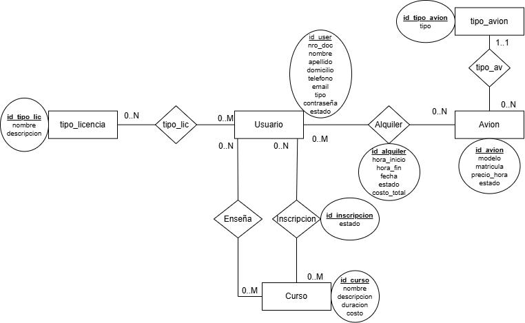

## Integrantes

52523 - Kalkov Lautaro

## Enunciado General

El sistema permite gestionar el alquiler de aviones en un aerodromo y los cursos disponibles para los socios del aeroclub, puede mostrar los horarios de los cursos y alquileres programados, listar los aviones disponibles para alquilar en cierto horario (filtrado por estado del avion y horarios del alquiler), ademas de ayudar con el calculo del costo de los alquileres y organizar los instructor y socios que participan en un curso.

## DER

## Regularidad
| Requerimiento    | Detalle/Listado de casos incluidos |
| :--------------- | ------------------------------------------------------------------------------------------------------ |
| ABMC simple      | Usuario  Avion |
| ABMC dependiente | Alquiler |
| CU NO-ABMC       | Alquilar Avión |
| Listado simple   | Listado de alquileres con datos de socio y avión |

## Aprobacion Directa

| Requerimiento                   | Detalle/Listado de casos incluidos                                                                                                                                                      |
| :------------------------------ | :-------------------------------------------------------------------------------------------------------------------------------------------------------------------------------------- |
| ABMC                            |  Usuario  tipo_licencia  Curso  Avion |
| CU "Complejo"                   | Gestión de alquiler de avión |
| Listado complejo                | Alquileres filtrados por fecha o socio |
| Nivel de acceso                 | Administrador  Socio |

